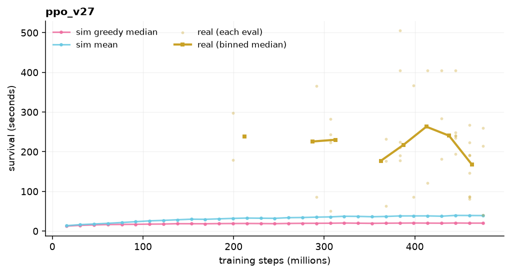
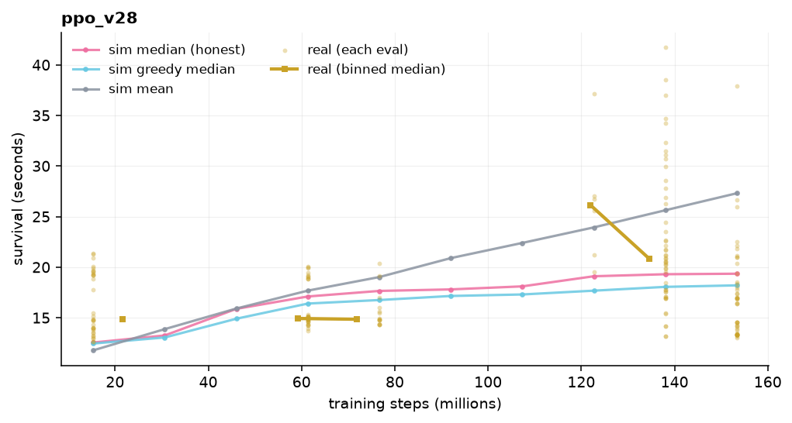
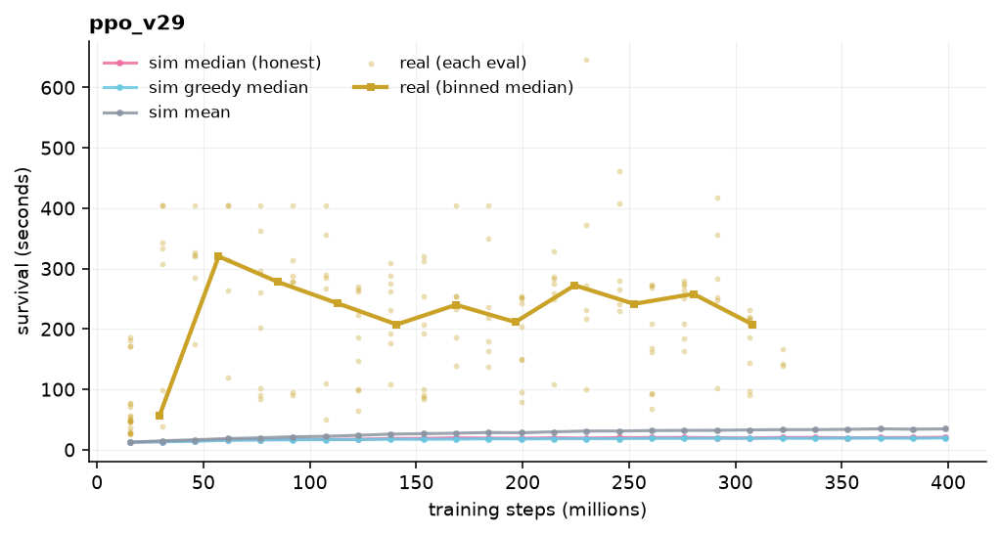
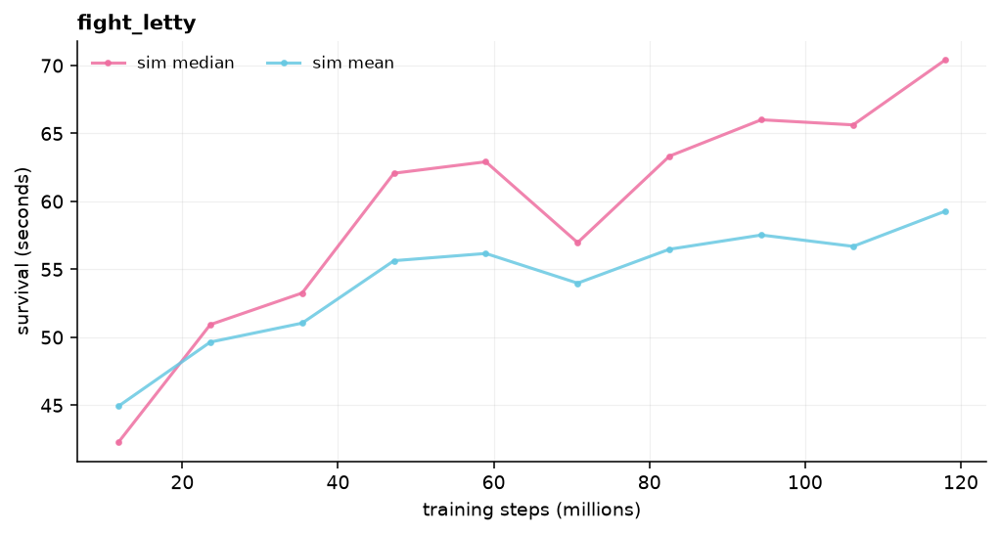

# 13 · Experiment log

The dated, quantitative companion to [Dead ends & lessons](dead-ends.md). Every
training run: what changed, what the sim curve did, what transferred, verdict.

!!! warning "Sim score is not real transfer"
    The procedural sim is deliberately brutal (domain randomization), so its
    survival numbers run ~20–40 s while the *same policy* survives ~200–300 s on
    the real game. Always read the **real** line, not the sim line. `ppo_v26` got
    *worse* on the real game while its sim median rose.

!!! note "How this is kept"
    After a run, `python tools/plot_run.py runs_sim/<name>` writes the curve to
    `docs/assets/curves/<name>.png` (sim series + the `realtransfer.npy` overlay)
    and copies `history.npy` to `runs_meta/`. `.pt` weights stay out of git.
    The *what changed* / *verdict* columns are written by hand.

## Current best

| Metric | Value | From |
|---|---|---|
| Real playthrough (peak) | **~470 s**, stages 1–3 | `ppo_v12` — retired 212-d obs |
| Real transfer, current obs | **~225 s** median (stages 1–2) | `ppo_v27` / `ppo_v29` |
| Recorded-boss transfer | 150–190 s on real Letty | `fight_letty` (but baseline clears Letty 6/6) |

The current 236-d observation has **not** reproduced `ppo_v12`'s reach. Every
domain-randomized run plateaus around "clears stage 1, dies in stage 2."

## The PPO arc

Read top-to-bottom.

### v12 and the 212-d era — peak

`ppo_v12` reached **~470 s real, stages 1–3** at ~200 M steps on a 212-d
observation. `ppo_v22` (an early re-run) hit **~368 s at only 82 M steps**. This
is the bar everything since has failed to clear. The 212-d obs was later widened
to 236-d (new enemy/item blocks, focus-aware escape) and `ppo_v12` no longer
loads against the current code.

### v23–v25 — trying to teach shooting, the policy games it

Added a front-only shot model, aimed enemy bursts, and a top-down "spam phase"
to push the agent to engage enemies. Over 1000 M steps `ppo_v25` **regressed to
~159 s**. The kill and power rewards were too weak relative to the survival
bonus, so the optimal policy was to *stop shooting and just dodge* — which is
fine in the sim and useless for a real run where you need power.

> **Realisation.** You cannot bolt "shoot enemies" onto a survival objective with
> a small reward term. The agent will find the survive-only local optimum.

### v26 — stronger engagement rewards, overfits

Cranked the enemy-damage reward (`0.10 → 0.35`), item reward (`0.30 → 0.60`),
added a power-standing bonus, widened the enemy hit radius, capped episodes at
240 s, split the death signal by cause. On a **fixed** sim stage it learned to
engage — and transfer got *worse* as the sim score climbed. `best.pt`, ranked by
sim score, was the most overfit checkpoint in the run.

> **Realisation.** A fixed sim stage is a memorisation target. Rank checkpoints
> by transfer tests, not sim score.

### v27 — domain-randomization rewrite, recovers

Threw out the hand-tuned stage. Patterns are now procedurally generated per
episode with heavy randomization of density, speed, aim, and emitter layout.
Real transfer came back to **~223 s median** (41–505 s range). The last
current-obs run that clearly worked.

### v28 — observation normalization, catastrophic

Standardized each obs feature to zero-mean/unit-variance using sim statistics.
Features that are constant in the sim (empty item slots, walls) got divided by a
near-zero std, folding their weights up ~`1e4×`. On real obs the network
exploded. Real transfer **collapsed to 18 s median** (13–42 s) despite a
perfectly healthy sim curve. Reverted (`65a4d78`).

### v29 — v27 plus a batch of refinements, marginal

v27 randomization + AABB collision (was circular) + a bottom-camp penalty +
focus-aware escape scalars + reward normalization + LR annealing, **no** obs
normalization. Real transfer **~231 s median** (68–645 s), flat after ~100 M
steps. Basically a wash versus v27 — the plateau is the sim's, not the run's.
Snapshots saved every 40 M for transfer-testing (`snap_*.pt`); `best.pt` still
underperforms mid-training snapshots, per the v26 lesson.

## Runs

| Run | Date | What changed | Real transfer | Verdict |
|---|---|---|---|---|
| `fight_letty` | 2026-08-31 | recorded-Letty FightSim + re-aiming + real hitboxes + lethal enemy bodies; from scratch | 150–190 s on real Letty | inconclusive — Letty too easy (baseline 6/6) |
| `ppo_v29` | 2026-08-30 | v27 + AABB collision + focus-aware escape + reward-norm + LR anneal | ~231 s median | wash vs v27 |
| `ppo_v28` | 2026-08-29 | + obs normalization | ~18 s median | **killed** |
| `ppo_v27` | 2026-08-28 | domain-randomization rewrite | ~223 s median | works; the current baseline |
| `ppo_v26` | — | stronger enemy/item rewards, fixed sim stage | worse as sim rose | overfit |
| `ppo_v25` | — | front-only shot + aimed bursts + spam phase, 1000 M | ~159 s | regressed — stopped engaging |
| `ppo_v22` | — | early 236-d re-run | ~368 s, 82 M steps | strong; preserved |
| `ppo_v12` | — | 212-d era | **~470 s**, stages 1–3 | best to date; obs retired |

### ppo_v27

### ppo_v28 — obs normalization

The sim curve is fine; real transfer sits at the floor the whole run.

### ppo_v29

The gap between the sim lines (~20–35 s) and the real line (~230 s) is the whole
point of this chapter.

### fight_letty

No `realtransfer.npy` for this run — the real number is one `eval_boss.py` pass:
150–190 s on real Letty, 3/6 full clears.

## Sim throughput

| Change | env-frames/s | Notes |
|---|---|---|
| FightSim, eager PyTorch | 115k | ~40 kernel launches/step, overhead-bound |
| `+ torch.compile` + dedup `_now()` | **273k** | build_obs fused; grid-march graph-break fixed |
| `+ bigger batch (24576)` | 277k | no gain — compute-bound now |

End-to-end training went ~40k → ~250k frames/s (~6×).
